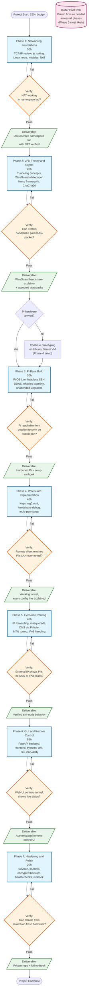

# Development Workflow

```mermaid
flowchart TD
    Start([Project Start: 250h budget]) --> P1

    P1["Phase 1: Networking Foundations<br/>30h<br/>TCP/IP review, ip tooling,<br/>Linux netns, nftables, NAT"]
    P1 --> P1T{Verify:<br/>NAT working<br/>in namespace lab?}
    P1T -->|Pass| P1D[/"Deliverable:<br/>Documented namespace lab<br/>with NAT verified"/]
    P1T -->|Fail| P1
    P1D --> P2

    P2["Phase 2: VPN Theory and Crypto<br/>20h<br/>Tunneling concepts,<br/>WireGuard whitepaper,<br/>Noise framework, ChaCha20"]
    P2 --> P2T{Verify:<br/>Can explain<br/>handshake packet-by-packet?}
    P2T -->|Pass| P2D[/"Deliverable:<br/>WireGuard handshake explainer<br/>+ accepted drawbacks"/]
    P2T -->|Fail| P2
    P2D --> PiCheck

    PiCheck{Pi hardware<br/>arrived?}
    PiCheck -->|No| Proto["Continue prototyping<br/>on Ubuntu Server VM<br/>(Phase 4 setup)"]
    PiCheck -->|Yes| P3
    Proto --> P3

    P3["Phase 3: Pi Base Build<br/>20h<br/>Pi OS Lite, headless SSH,<br/>DDNS, nftables baseline,<br/>unattended-upgrades"]
    P3 --> P3T{Verify:<br/>Pi reachable from<br/>outside network on<br/>known port?}
    P3T -->|Pass| P3D[/"Deliverable:<br/>Hardened Pi + setup runbook"/]
    P3T -->|Fail| P3
    P3D --> P4

    P4["Phase 4: WireGuard Implementation<br/>40h<br/>Keys, wg0.conf,<br/>handshake debug,<br/>multi-peer setup"]
    P4 --> P4T{Verify:<br/>Remote client reaches<br/>Pi's LAN over tunnel?}
    P4T -->|Pass| P4D[/"Deliverable:<br/>Working tunnel,<br/>every config line explained"/]
    P4T -->|Fail| P4
    P4D --> P5

    P5["Phase 5: Exit Node Routing<br/>40h<br/>IP forwarding, masquerade,<br/>DNS via Pi-hole,<br/>MTU tuning, IPv6 handling"]
    P5 --> P5T{Verify:<br/>External IP shows Pi's,<br/>no DNS or IPv6 leaks?}
    P5T -->|Pass| P5D[/"Deliverable:<br/>Verified exit-node behavior"/]
    P5T -->|Fail| P5
    P5D --> P6

    P6["Phase 6: GUI and Remote Control<br/>55h<br/>FastAPI backend,<br/>frontend, systemd unit,<br/>TLS via Caddy"]
    P6 --> P6T{Verify:<br/>Web UI controls tunnel,<br/>shows live status?}
    P6T -->|Pass| P6D[/"Deliverable:<br/>Authenticated remote-control UI"/]
    P6T -->|Fail| P6
    P6D --> P7

    P7["Phase 7: Hardening and Polish<br/>20h<br/>fail2ban, journald,<br/>encrypted backups,<br/>health checks, runbook"]
    P7 --> P7T{Verify:<br/>Can rebuild from<br/>scratch on fresh hardware?}
    P7T -->|Pass| P7D[/"Deliverable:<br/>Private repo + full runbook"/]
    P7T -->|Fail| P7
    P7D --> Done([Project Complete])

    Buffer[("Buffer Pool: 25h<br/>Drawn from as needed<br/>across all phases<br/>(Phase 5 most likely)")]

    classDef phaseBox fill:#e1f5fe,stroke:#01579b,stroke-width:2px
    classDef testBox fill:#fff3e0,stroke:#e65100,stroke-width:2px
    classDef deliverableBox fill:#e8f5e9,stroke:#2e7d32,stroke-width:2px
    classDef bufferBox fill:#fce4ec,stroke:#880e4f,stroke-width:2px

    class P1,P2,P3,P4,P5,P6,P7 phaseBox
    class P1T,P2T,P3T,P4T,P5T,P6T,P7T testBox
    class P1D,P2D,P3D,P4D,P5D,P6D,P7D deliverableBox
    class Buffer bufferBox
```