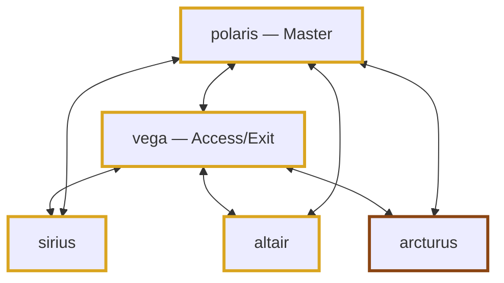
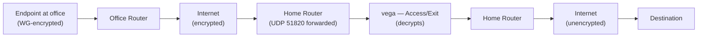
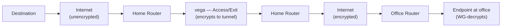
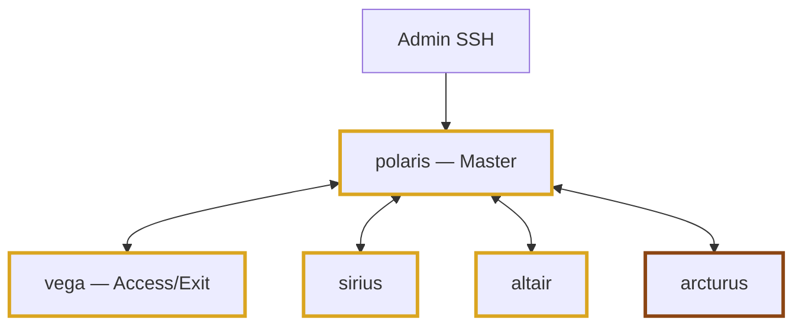
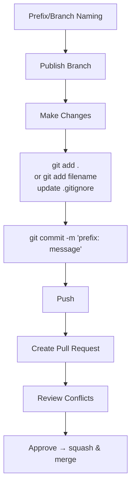

# Mesh VPN Project — Architecture Flowcharts (Post-Pivot)

> **Architecture pivot status**: Committed. The home network is now the public-facing site (port-forwarded UDP 51820 → vega). The business network hosts office endpoints that connect outbound only.
>
> Endpoint placement (sirius/altair/arcturus across home vs office) is TBD; the assignments below assume 2 at home + 1 at office. Adjust as planning finalizes.

---

## Mesh Topology

---

## Data Plane — Outbound Traffic

*Scenario: an endpoint at the office wants to reach a destination on the internet, exiting through home.*

---

## Data Plane — Inbound Traffic

*Scenario: response from the destination travels back to the office endpoint.*

---

## Control Plane

**Legend**
- Yellow outline = at home network (public-facing site)
- Brown outline = at office network (endpoint-only, no inbound exposure)

---

## Git Workflow

*(Architecture-agnostic — same as pre-pivot.)*

