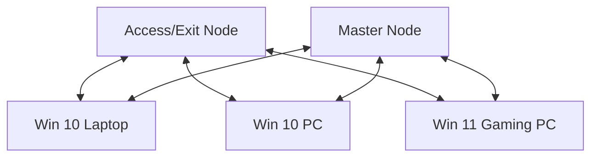
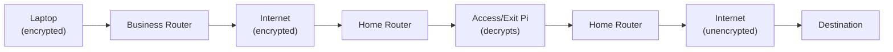
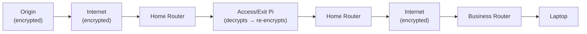
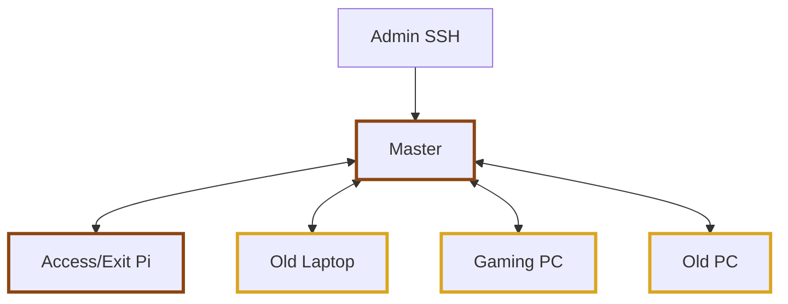
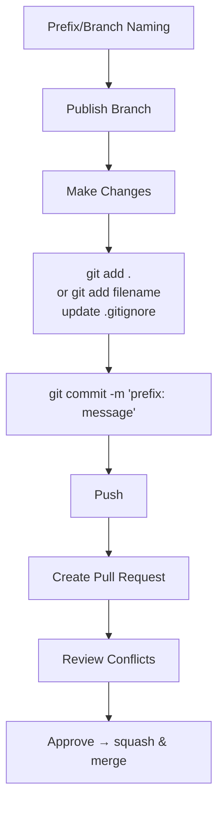

# Mesh VPN Project — Architecture Flowcharts

> **Note**: The Data Plane and Control Plane diagrams below mirror the original Canva flowchart, which reflects the **pre-pivot architecture** (access/exit node hosted at the business site). After the Saturday pivot, the access/exit node lives at home. These two diagrams need content updates — but the Mermaid structure is in place to make those edits trivial.

---

## Mesh Topology

---

## Data Plane — Outbound Traffic

---

## Data Plane — Inbound Traffic

---

## Control Plane

**Legend**
- Brown outline = connection at business site
- Yellow outline = connection at home site

---

## Git Workflow

