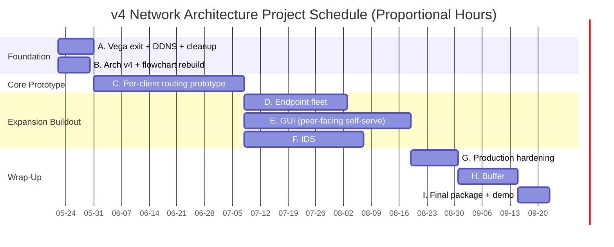

```mermaid
gantt
    title v4 Network Architecture Project Schedule (Proportional Hours)
    dateFormat  YYYY-MM-DD
    axisFormat  %m-%d
    
    section Foundation
    A. Vega exit + DDNS + cleanup    :a, 2026-05-22, 9d
    B. Arch v4 + flowchart rebuild   :b, 2026-05-22, 8d
    
    section Core Prototype
    C. Per-client routing prototype  :c, after a b, 38d
    
    section Expansion Buildout
    D. Endpoint fleet                :d, after c, 26d
    E. GUI (peer-facing self-serve)  :e, after c, 42d
    F. IDS                           :f, after c, 30d
    
    section Wrap-Up
    G. Production hardening          :g, after d e f, 12d
    H. Buffer                        :h, after g, 15d
    I. Final package + demo          :i, after h, 8d
```