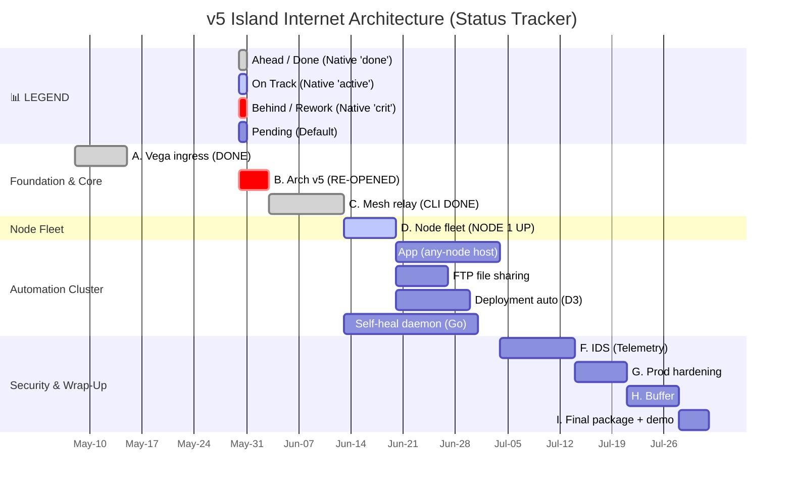

```mermaid
gantt
    title v5 Island Internet Architecture (Status Tracker)
    dateFormat  YYYY-MM-DD
    axisFormat  %b-%d
    
    section 📊 LEGEND
    Ahead / Done (Native 'done')   : done, leg1, 2026-05-30, 1d
    On Track (Native 'active')     : active, leg2, 2026-05-30, 1d
    Behind / Rework (Native 'crit'): crit, leg3, 2026-05-30, 1d
    Pending (Default)              : leg4, 2026-05-30, 1d

    section Foundation & Core
    A. Vega ingress (DONE)           : done, a, 2026-05-08, 7d
    B. Arch v5 (RE-OPENED)           : crit, b, 2026-05-30, 4d
    C. Mesh relay (CLI DONE)         : done, c, after b, 10d
    
    section Node Fleet
    D. Node fleet (NODE 1 UP)        : active, d, after c, 7d
    
    section Automation Cluster
    App (any-node host)              : app, after d, 14d
    FTP file sharing                 : ftp, after d, 7d
    Deployment auto (D3)             : dep, after d, 10d
    Self-heal daemon (Go)            : dae, after c, 18d
    
    section Security & Wrap-Up
    F. IDS (Telemetry)               : f, after app ftp dep, 10d
    G. Prod hardening                : g, after f dae, 7d
    H. Buffer                        : h, after g, 7d
    I. Final package + demo          : i, after h, 4d
```
