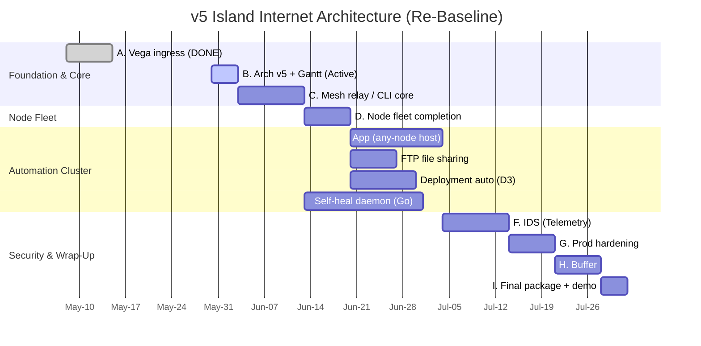

### Legend

| Phase | Description                              | Hrs |
|-------|------------------------------------------|-----|
| A     | Finish vega exit + cleanup               | 9   |
| B     | Architecture v4 + flowchart rebuild      | 8   |
| C     | Per-client routing prototype             | 38  |
| D     | Endpoint fleet                           | 26  |
| E     | GUI (peer-facing self-serve)             | 42  |
| F     | IDS (network + tunnel detection)         | 30  |
| G     | Production hardening                     | 12  |
| H     | Buffer                                   | 15  |
| I     | Final package + demo                     | 8   |
|       | **Total**                                | **188** |

**Critical path:** A → C → E → G → H → I = 96 days (May 8 → Aug 12).
Durations sized at ~0.77 days/hr on the critical path; parallel tracks (B, D, F) fit inside the windows of A and E.
