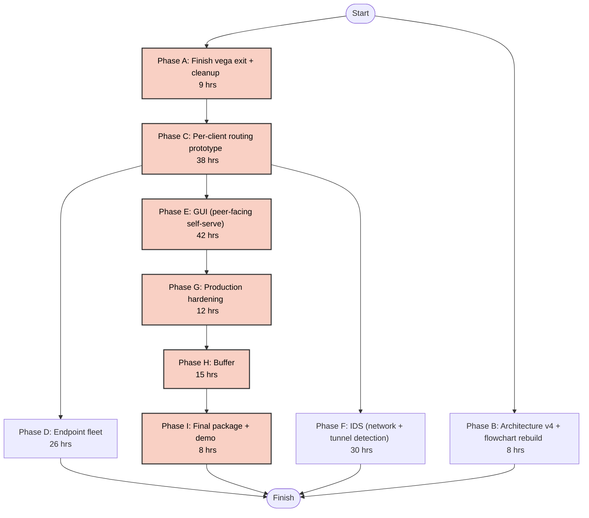

```mermaid
graph TD
    Start([Start]) --> A[Phase A: Finish vega exit + cleanup <br> 9 hrs]
    Start --> B[Phase B: Architecture v4 + flowchart rebuild <br> 8 hrs]

    A --> C[Phase C: Per-client routing prototype <br> 38 hrs]

    C --> D[Phase D: Endpoint fleet <br> 26 hrs]
    C --> E["Phase E: GUI (peer-facing self-serve) <br> 42 hrs"]
    C --> F["Phase F: IDS (network + tunnel detection) <br> 30 hrs"]

    E --> G[Phase G: Production hardening <br> 12 hrs]

    G --> H[Phase H: Buffer <br> 15 hrs]
    H --> I[Phase I: Final package + demo <br> 8 hrs]
    I --> Finish([Finish])

    B --> Finish
    D --> Finish
    F --> Finish

    classDef critical fill:#f9d0c4,stroke:#333,stroke-width:2px,color:#000;
    class A,C,E,G,H,I critical;
```
