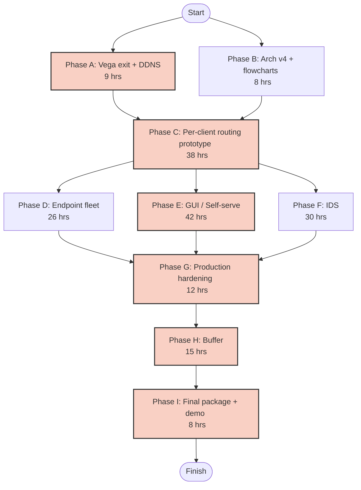

```mermaid
graph TD
    Start([Start]) --> A[Phase A: Vega exit + DDNS <br> 9 hrs]
    Start --> B[Phase B: Arch v4 + flowcharts <br> 8 hrs]
    
    A --> C[Phase C: Per-client routing prototype <br> 38 hrs]
    B --> C
    
    C --> D[Phase D: Endpoint fleet <br> 26 hrs]
    C --> E[Phase E: GUI / Self-serve <br> 42 hrs]
    C --> F[Phase F: IDS <br> 30 hrs]
    
    D --> G[Phase G: Production hardening <br> 12 hrs]
    E --> G
    F --> G
    
    G --> H[Phase H: Buffer <br> 15 hrs]
    H --> I[Phase I: Final package + demo <br> 8 hrs]
    I --> Finish([Finish])
    
    classDef critical fill:#f9d0c4,stroke:#333,stroke-width:2px;
    class A,C,E,G,H,I critical;
```