# System Architecture

## Overview

This VPN routes a remote client's traffic through a Raspberry Pi acting as an exit node in State College, PA. From the perspective of any service the client connects to, traffic appears to originate from the Pi's home public IP — the client's actual location is hidden behind the encrypted tunnel.

The architecture has four logical zones, each with distinct trust and security properties:

**1. Client zone (untrusted environment).** The client is anywhere on the public internet — a laptop on a coffee shop WiFi, a phone on cellular. WireGuard's `wg0` interface on the client encrypts all outbound traffic before it leaves the device, using session keys derived during the Noise IK handshake. The client locates the Pi via DDNS (`vpn-pi.duckdns.org`) since the home public IP is dynamic.

**2. Tunnel zone (cryptographic boundary).** All traffic between client and Pi crosses the public internet as ChaCha20-Poly1305-encrypted UDP packets on port 51820. The tunnel is opaque to ISPs and any in-path observer. Authentication is mutual: both peers verify each other's static Curve25519 public keys configured out of band, and MAC1/MAC2 fields prevent unauthenticated packets from consuming Pi resources.

**3. Pi zone (trusted infrastructure).** The Raspberry Pi receives encrypted UDP at its public-facing interface (via router port-forward), decrypts via `wg-quick@wg0`, and routes the resulting plaintext packets through the kernel's IP forwarding path. Outbound traffic is source-NAT'd via nftables MASQUERADE on the LAN-side interface, making it appear to originate from the Pi rather than the client. Local services (Pi-hole DNS, web UI, SSH) are bound to `wg0` so they're only reachable through the tunnel — administrative attack surface is hidden behind the cryptographic boundary.

**4. Destination zone (cleartext internet).** Once traffic exits the Pi via `eth0`, it enters the public internet looking like ordinary residential traffic from State College. The destination has no visibility into the original client, only the home public IP.

DNS is handled inside the tunnel: clients are configured (via WireGuard's `DNS =` field) to use the Pi-hole resolver at `10.7.0.1`, preventing DNS leaks where queries would otherwise bypass the tunnel and expose browsing activity to the client's local ISP.

## Architecture Diagram

```mermaid
flowchart TD
    Client["<b>Client Device</b><br/>(anywhere on internet)<br/>━━━━━━━━━━━━━━━━━━<br/>Applications: browser, SSH, etc.<br/>wg0 tunnel IP: 10.7.0.2/24<br/>AllowedIPs: 0.0.0.0/0, ::/0<br/>MTU: 1420"]

    Client -->|"plaintext → tunnel"| Crypto

    Crypto["<b>WireGuard Encryption Boundary</b><br/>━━━━━━━━━━━━━━━━━━<br/>Noise IK handshake<br/>Curve25519 ECDH + static keys<br/>ChaCha20-Poly1305 transport<br/>UDP 51820"]

    Crypto -->|"encrypted UDP"| Internet

    Internet["<b>Public Internet</b><br/>━━━━━━━━━━━━━━━━━━<br/>Tunnel traffic opaque to ISPs<br/>Endpoint resolved via DDNS:<br/>vpn-pi.duckdns.org → dynamic home IP"]

    Internet --> Router

    Router["<b>Home Router — State College, PA</b><br/>━━━━━━━━━━━━━━━━━━<br/>LAN: 192.168.1.0/24<br/>Public IP: dynamic<br/>Port forward: UDP 51820 → Pi"]

    Router --> Pi

    subgraph Pi["<b>Raspberry Pi 5 — Exit Node (Pi OS Lite 64-bit)</b>"]
        direction TB

        PiIface["<b>Network Interfaces</b><br/>━━━━━━━━━━━━━━━━━━<br/>eth0: 192.168.1.10/24 — MTU 1500 (LAN)<br/>wg0: 10.7.0.1/24 — MTU 1420 (tunnel gateway)"]

        PiIface --> WGProc

        WGProc["<b>wg-quick@wg0.service</b><br/>━━━━━━━━━━━━━━━━━━<br/>1. Receive UDP 51820 on eth0<br/>2. Validate MAC1/MAC2 (drop if invalid)<br/>3. Decrypt with session key<br/>4. Inject plaintext packet into wg0"]

        WGProc --> RouteDecision

        RouteDecision{"<b>Kernel Routing</b><br/>net.ipv4.ip_forward = 1"}

        RouteDecision -->|"destined for<br/>local services"| LocalServices
        RouteDecision -->|"destined for<br/>internet"| MASQ

        LocalServices["<b>Local Services (bound to wg0 only)</b><br/>━━━━━━━━━━━━━━━━━━<br/>• Pi-hole DNS — 10.7.0.1:53 (prevents leaks, ad-block)<br/>• Web UI — TCP 443 (Caddy + FastAPI + Let's Encrypt)<br/>• SSH — TCP 22 (key-only, fail2ban protected)"]

        MASQ["<b>nftables MASQUERADE</b><br/>━━━━━━━━━━━━━━━━━━<br/>POSTROUTING chain on eth0<br/>Rewrites src 10.7.0.x → 192.168.1.10<br/>conntrack tracks flows for return path"]

        MASQ --> PiOut["<b>eth0 outbound</b><br/>→ router → public IP"]
    end

    PiOut --> Dest

    Dest["<b>Destination Services on Internet</b><br/>━━━━━━━━━━━━━━━━━━<br/>Traffic source: home public IP<br/>Client effectively appears in State College, PA<br/>Original client identity not visible"]

    classDef clientBox fill:#e3f2fd,stroke:#1565c0,stroke-width:2px,color:#000
    classDef cryptoBox fill:#f3e5f5,stroke:#6a1b9a,stroke-width:2px,color:#000
    classDef internetBox fill:#fff8e1,stroke:#f57f17,stroke-width:2px,color:#000
    classDef piBox fill:#e8f5e9,stroke:#2e7d32,stroke-width:2px,color:#000
    classDef destBox fill:#fff3e0,stroke:#e65100,stroke-width:2px,color:#000
    classDef decisionBox fill:#fce4ec,stroke:#880e4f,stroke-width:2px,color:#000

    class Client clientBox
    class Crypto cryptoBox
    class Internet,Router internetBox
    class Pi,PiIface,WGProc,LocalServices,MASQ,PiOut piBox
    class Dest destBox
    class RouteDecision decisionBox
```

## Key Architectural Decisions

A few choices in this architecture deserve explicit justification:

**Local services bound to `wg0`, not `eth0`.** Pi-hole, the web UI, and (eventually) SSH listen only on the tunnel interface. This means the management plane is unreachable from the public internet — to access it, an attacker would first need a valid WireGuard session, which requires the configured private key. The tunnel itself becomes the authentication layer for everything inside.

**MASQUERADE rather than 1:1 NAT or routed subnet.** The Pi rewrites source addresses on outbound packets so the client's tunnel IP (10.7.0.2) never appears on the public internet — only the Pi's home IP does. This is simpler than configuring routed subnets and avoids exposing internal addressing schemes.

**Pi-hole as DNS resolver inside the tunnel.** Pushing DNS via the WireGuard config (`DNS = 10.7.0.1`) prevents the client from sending DNS queries to its local ISP's resolver, which would expose browsing activity even with the rest of traffic encrypted. This is the most common DNS-leak failure mode in exit-node setups.

**DDNS for dynamic home IP.** Residential ISPs typically issue dynamic public IPs that change periodically. A cron job on the Pi updates a DDNS provider's A record so clients can locate the endpoint by hostname rather than chasing IP changes.