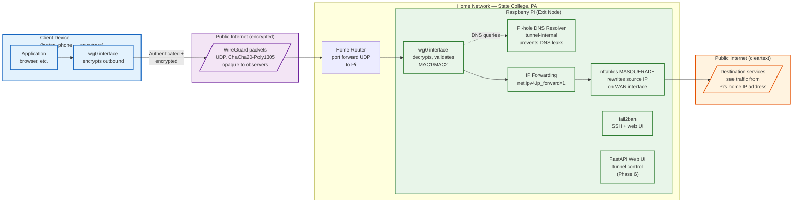

# System Architecture

```mermaid
flowchart LR
    subgraph Client["Client Device<br/>(laptop, phone — anywhere)"]
        ClientApp[Application<br/>browser, etc.]
        ClientWG[wg0 interface<br/>encrypts outbound]
        ClientApp --> ClientWG
    end

    subgraph PublicNet1["Public Internet (encrypted)"]
        EncTraffic[/"WireGuard packets<br/>UDP, ChaCha20-Poly1305<br/>opaque to observers"/]
    end

    ClientWG -->|"Authenticated +<br/>encrypted"| EncTraffic

    subgraph Home["Home Network — State College, PA"]
        Router["Home Router<br/>port forward UDP<br/>to Pi"]

        subgraph Pi["Raspberry Pi (Exit Node)"]
            PiWG["wg0 interface<br/>decrypts, validates<br/>MAC1/MAC2"]
            PiHole["Pi-hole DNS Resolver<br/>tunnel-internal<br/>prevents DNS leaks"]
            Forward["IP Forwarding<br/>net.ipv4.ip_forward=1"]
            NFT["nftables MASQUERADE<br/>rewrites source IP<br/>on WAN interface"]
            Fail2ban["fail2ban<br/>SSH + web UI"]
            WebUI["FastAPI Web UI<br/>tunnel control<br/>(Phase 6)"]

            PiWG --> Forward
            PiWG -.->|DNS queries| PiHole
            Forward --> NFT
        end

        Router --> PiWG
    end

    EncTraffic --> Router

    subgraph PublicNet2["Public Internet (cleartext)"]
        Dest[/"Destination services<br/>see traffic from<br/>Pi's home IP address"/]
    end

    NFT --> Dest

    classDef clientBox fill:#e3f2fd,stroke:#1565c0,stroke-width:2px
    classDef encBox fill:#f3e5f5,stroke:#6a1b9a,stroke-width:2px
    classDef piBox fill:#e8f5e9,stroke:#2e7d32,stroke-width:2px
    classDef destBox fill:#fff3e0,stroke:#e65100,stroke-width:2px

    class Client,ClientApp,ClientWG clientBox
    class PublicNet1,EncTraffic encBox
    class Pi,PiWG,PiHole,Forward,NFT,Fail2ban,WebUI piBox
    class PublicNet2,Dest destBox
```